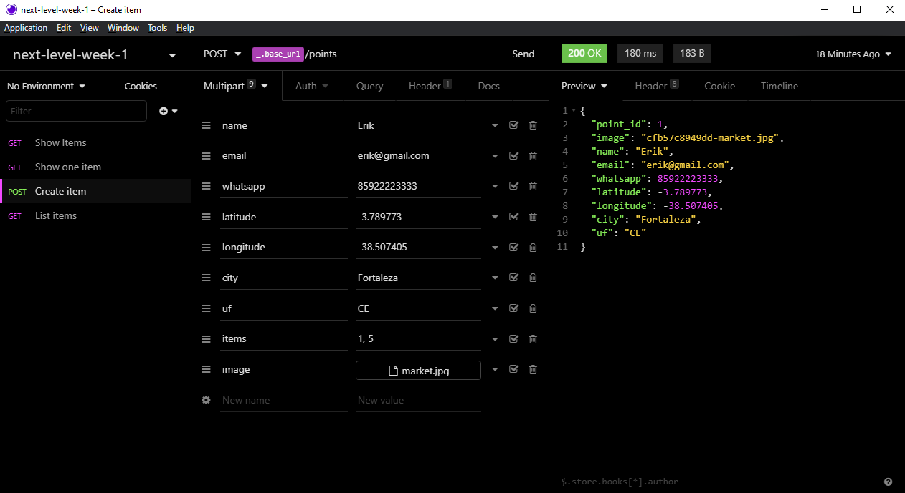

<h1 align="center">
    
</h1>

    

## :rocket: Tecnologias

Foram usadas as seguintes tecnologias:

- [Node.js](https://nodejs.org/en/)
- [React](https://reactjs.org)
- [React Native](https://reactnative.dev)
- [Expo](https://expo.io)
- [Typescript](https://www.typescriptlang.org)

## :computer: Projeto

Projeto desenvolvido durante a 1ª edição do Next Level Week pela [Rocketseat](https://rocketseat.com.br) com o objetivo de ajudar as pessoas a encontrarem pontos de coleta de resíduos de forma eficiente. Uma das coisas mais importantes nesse projeto é a utilização do Typescript, que ajuda muito devido a visualização da estrutura que recebo em um parâmetro, e utilizando junto do Visual Studio Code, a IntelliSense aumenta bastante a produtividade. 

Se você acha que o Typescript atrapalha quem é iniciante, ou que não esta presente no mercado, ou ate mesmo que ao usá-lo você acaba transformando o Javascript em Java ou C#, se liga nesse [blog da Rocketseat](https://blog.rocketseat.com.br/typescript-vantagens-mitos-conceitos/), e acabe de vez com esses mitos.

## :thinking: Como acessar a API?

<h1 align="center">
    
</h1>

Baixo o [Insomnia](https://insomnia.rest), clique em `Application > Preferences > Data > Import Data > From URL`, e cole a seguinte url `https://github.com/erik-ferreira/next-level-week-1/blob/main/Insomnia_2021-02-10.json`
